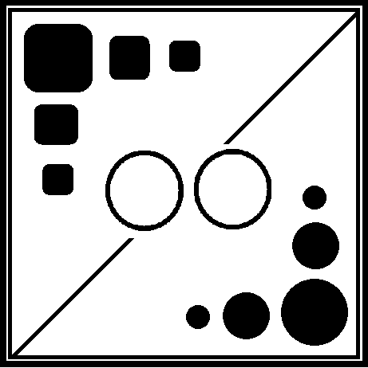
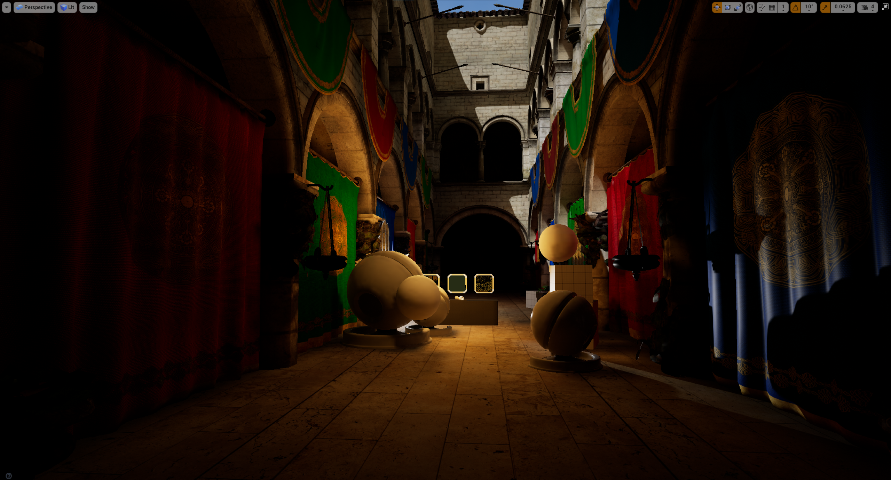
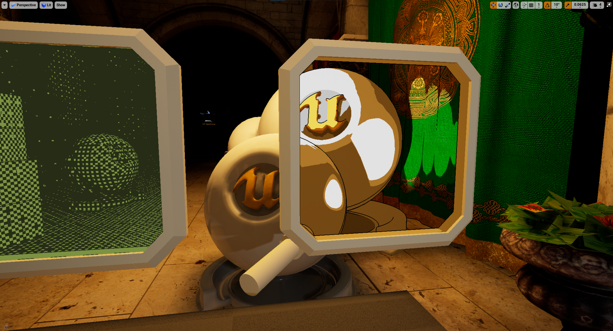

<p align="center">
  
</p>


<h2 align="center"> Stylized Rendering in VR </h2>


### The Facts


**Team:** William Meldrum

**Release**: 12/12/2021

**Platforms**: All SteamVR headsets

**Repository**: https://github.com/WmeldrumU/VrFinal


### Pitch

This project is a quick study of realtime stylized rendering in VR. There are many examples of stylized rendering, both VR and non-VR, (i.e. Return of the Obra Dinn, Guilty Gear Strive, Okami) but typically only one style of rendering is used and it can't be interacted with in any way. This project allows for the user to "peek" through multiple windows to view how the world can be shaded differently. 


<iframe width="560" height="315" src="https://www.youtube.com/embed/3tGW95dl4HM" title="YouTube video player" frameborder="0" allow="accelerometer; autoplay; clipboard-write; encrypted-media; gyroscope; picture-in-picture" allowfullscreen></iframe>

<p align="center">
  
  
  
  
  
  
</p>

### History 

I love graphics. I have been able to become certified in visual computing through the University of Utah and want to get as experienced as possible with different rendering technologies. VR seemed like a great medium to explore different rendering styles by looking through different windows in the environment. I didn't know if I'd be able to do it, but I wanted to do it regardless to learn more. 

### Features

- 1-bit shader: This shader was inspired by the original Game Boy and recent games like the aformentioned Return of the Obra Dinn
- Cel-shader: One of the most common types of stylized shading, seen in projects like Okami and Borderlands
- Cross-hatch shader: Meant to simulate handdrawn illustrations with pencil


You can use the [editor on GitHub](https://github.com/WmeldrumU/VrFinal/edit/gh-pages/index.md) to maintain and preview the content for your website in Markdown files.

Whenever you commit to this repository, GitHub Pages will run [Jekyll](https://jekyllrb.com/) to rebuild the pages in your site, from the content in your Markdown files.

### About

**The Team**: Just me here! I love to tinker with graphics technologies and I found this class as a great opporunity to do so!

**Contact**: William Meldrum - wmeldrum1@gmail.com

**Faculty Sponsor**: Rogelio E. Cardona-Rivera, Ph.D - rogelio@cs.utah.edu


<!--
### Markdown

Markdown is a lightweight and easy-to-use syntax for styling your writing. It includes conventions for

```markdown
Syntax highlighted code block

# Header 1
## Header 2
### Header 3

- Bulleted
- List

1. Numbered
2. List

**Bold** and _Italic_ and `Code` text

[Link](url) and 
```

For more details see [Basic writing and formatting syntax](https://docs.github.com/en/github/writing-on-github/getting-started-with-writing-and-formatting-on-github/basic-writing-and-formatting-syntax).

### Jekyll Themes

Your Pages site will use the layout and styles from the Jekyll theme you have selected in your [repository settings](https://github.com/WmeldrumU/VrFinal/settings/pages). The name of this theme is saved in the Jekyll `_config.yml` configuration file.

### Support or Contact

Having trouble with Pages? Check out our [documentation](https://docs.github.com/categories/github-pages-basics/) or [contact support](https://support.github.com/contact) and we’ll help you sort it out.

-->
